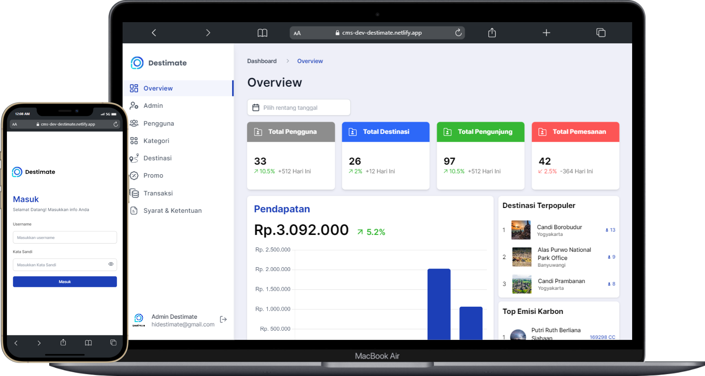

# DESTIMATE FRONTEND - CMS


<details>
  <summary>Table of Contents</summary>
  <ol>
    <li>
      <a href="#about-the-project">About The Project</a>
      <ul>
        <li><a href="#features">Features</a></li>
        <li><a href="#built-with">Built With</a></li>
        <li><a href="#project-structure">Project Structure</a></li>
      </ul>
    </li>
    <li>
      <a href="#getting-started">Getting Started</a>
      <ul>
        <li><a href="#installation">Installation</a></li>
        <li><a href="#configuration">Configuration</a></li>
      </ul>
    </li>
    <li><a href="#deployment">Deployment</a></li>
    <li><a href="#contributors">Contributors</a></li>
  </ol>
</details>

## About The Project
The CMS Destimate is a web application designed to effectively manage content for the Destimate mobile application and serves as a centralized platform for organizing and updating related to tours and user account settings. 

### Features
- View Dashboard
- Manage User Detail
- Manage User Routes
- Manage Contents
- Manage Destination
- Add Custom Data for OpenAI (AI Implementation) 

### Built With
This project is built utilizing several technology stacks, as listed below </br>
[![React][React.js]][React-url]
[![Vite][Vite]][Vite-url]
[![Tailwind][Tailwind]][Tailwind-url]
[![Github][Github]][Github-url]
[![React Hook Form][React_Hook_Form]][React-hook-form-url]
</br>

[![Netlify][Netlify]][Netlify-url]
[![Redux][Redux]][Redux-url]
[![Antd][Antd]][Antd-url]
[![Shadcn][Shadcn]][Shadcn-url]

### Project Structure
Most of the code lives in the `src` folder and looks like this:

```sh
src
|
+-- apis              # all APIs used for feature integration
|
+-- assets            # assets folder can contain all the static files such as images, etc
|
+-- components        # shared components used across the entire application
|
+-- configs           # saving common configuration modules or external modules
|
+-- features          # features based modules
|
+-- hooks             # shared hooks used across the entire application
|
+-- lib               # all reusable modules or libraries used within the project
|
+-- providers         # all of the application providers
|
+-- routes            # routes configuration
|
+-- services          # all service logic for interating with data or external resources
|
+-- stores            # global state stores
|
+-- utils             # shared utility functions
```

## Getting Started
### Installation
To get started with the CMS Destimate, follow these steps:

1. Clone the Repository
    ```shell
    git clone https://github.com/Capstone-Tim-02/sustain-tour-frontend-cms.git
    ```    
2. Installation
    ```shell
    cd sustain-tour-frontend-cms
    npm install
    ```
3. Run the Application
    ```shell
    npm run dev
    ```

### Configuration

Please create a .env or .env.local file in the root of your project and fill it with this criteria
```
VITE_BASE_URL_API="Your API Key"
```

### Deployment
This project is deployed using netlify. You can access the production deployment at [this link](https://cms-destimate.netlify.app).


## Contributors
- July Dwi Saputra
- Angga Saputra
- Agung Nurprasetya Putra
- Almira Eka Putri Maharani
- Alfitra Fadjri
- Ahmad Rizky Has
- Maulidaturrohmah
- Ganang Aji Suseno

<!-- MARKDOWN LINKS & IMAGES -->
[React.js]: https://img.shields.io/badge/React-20232A?style=for-the-badge&logo=react&logoColor=61DAFB
[Tailwind]: https://img.shields.io/badge/Tailwind_CSS-092749?style=for-the-badge&logo=tailwindcss&logoColor=06B6D4
[Github]: https://img.shields.io/badge/Github-181717?style=for-the-badge&logo=github&logoColor=FFFFFF
[Netlify]: https://img.shields.io/badge/Netlify-0E1E25?style=for-the-badge&logo=netlify&logoColor=00C7B7
[Vite]: https://img.shields.io/badge/Vite-1B1B23?style=for-the-badge&logo=vite&logoColor=646CFF
[Redux]: https://img.shields.io/badge/Redux-764ABC?style=for-the-badge&logo=redux&logoColor=FFFFFF
[Antd]: https://img.shields.io/badge/Ant_Design-FFFFFF?style=for-the-badge&logo=antdesign&logoColor=0170FE
[Shadcn]: https://img.shields.io/badge/Shadcn/UI-000000?style=for-the-badge&logo=shadcn/ui&logoColor=FFFFFF
[React_Hook_Form]: https://img.shields.io/badge/React_Hook_Form-EC5990?style=for-the-badge&logo=reacthookform&logoColor=FFFFFF

[React-url]: https://reactjs.org/
[Tailwind-url]: https://tailwindcss.com/
[Github-url]: https://github.com/
[Netlify-url]: https://www.netlify.com/
[Vite-url]: https://vitejs.dev/
[Redux-url]: https://redux.js.org/
[Antd-url]: https://ant.design/
[Shadcn-url]: https://ui.shadcn.com/
[React-hook-form-url]: https://react-hook-form.com/